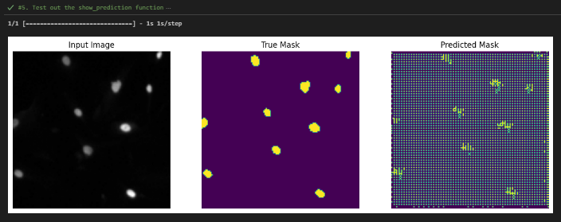
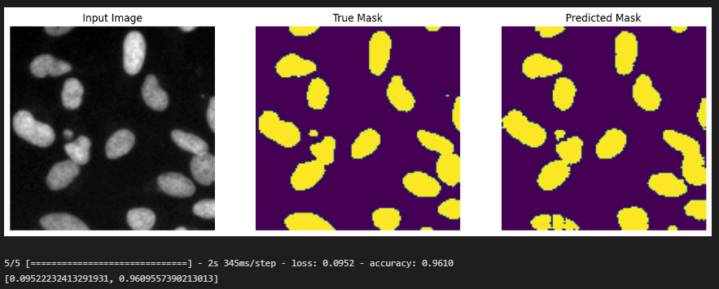

 

# Semantic Segmentation for Images Containing Cell Neuclei by using TensorFlow
 
 ## Summary

To speed up research on a variety of illnesses, such as cancer, heart disease, and uncommon ailments, an algorithm that can automatically recognise nuclei is needed. The development of remedies for a variety of illnesses, including chronic obstructive pulmonary disease, Alzheimer's, diabetes, and even the common cold, might be accelerated greatly with the help of such a tool.

Therefore, identifying cell nuclei is an important first step in many research investigations because it enables researchers to examine the DNA present in the nucleus, which contains the genetic information that governs the activity of each cell. Researchers can investigate how cells react to various treatments and learn more about the underlying biological mechanisms at work by identifying the nuclei of cells. It may be possible to speed up drug testing and shorten the period before new medications are made available to the general public with an automated AI model for detecting nuclei.

There several steps need to be complete to build the model.

1. Data Loading

  <ol>- In this project, I used operating system (os) to load the data by joining the dataset with train and test.</ol>
  <ol>- In order to upload the images of inputs and masks in the train and test dataset, I used opencv. In the coding, I also included the image's colour. For inputs, I set it to RGB and grayscale for masks. </ol>
  <ol>- I did the same procedure for testing data.</ol>
  

2. Data Pre-processing

   <ol>- The images was in list. Therefore, I converted the images to numpy array.</ol>
   <ol>- Then, I checked some examples. Image belows show the images in training data. </ol>
   

   <ol>- I expanded the mask dimension for training and testing data and check the mask output.</ol>
   <ol>- Then, I converted the masks value for training and testing data into class labels.</ol>
   <ol>- Train-validation split is being performed.</ol>
   <ol>- The numpy array for training data, validation data and testing data was then converted into tensor.</ol>
   <ol>Then, combine all images and masks using zip.</ol>
   

3. Data Cleaning

   <ol>- Data cleaning is important to increase overall productivity and allow for the highest quality information in your decision-making.</ol>
   <ol>- I used Regex to remove unwanted words which then leave only the words with alphabets A-Z</ol>
   <ol>- The alphabets are then all converted in lower case.</ol>
   <ol>- All of the duplicated data has been removed in this part as well.</ol>
   <ol>- I then did data augmentation.</ol>
   <ol>- The data is converted into prefetch dataset.</ol>
   <ol>- Then, I checked some examples. Image belows show the images in training data after prefetch the dataset. </ol>
   

 <ol>- The image was divided into two types, Inputs and Masks. Based on the image, the picture on the right, represent masks of the inputs on the left.</ol>

3. Model Development

   <ol>- Image segmentation model was created.</ol>
   <ol>- Then, I used pretrained model as the feature extraction layers.</ol>
   <ol>- I list down the activation layers, feature extraction model, unsampling path and the output layer.</ol>
<ol>- The model was used to construct the entire U-Net.</ol>
 

   
 
4. Model Evaluation

 <ol>- In this section, the prediction is displayed.</ol>
  

 <ol>- Based on the image above, the predicted image is not clear. Thus, the model need to be trained to get a better mask predicted.</ol>
 <ol>- I applied early stopping and tensorboard to improve the prediction</ol>
 
 
5. Model Training

 <ol>- After that, the model was trained. </ol>
 <ol>- Based on the image below, it shows that my predicted mask is clearer compared to before training the model.</ol>
 

 <ol>- The epoch accuracy and epoch loss was shown in the graph below. Based on the graph, the training data is in a good fit. </ol>
 

  

   
   
6. Model Deployment

   <ol>- The picture below shows predicted mask and evaluation result.</ol>
   

  <ol>- After training the model, my accuracy is 96%.</ol>
  <ol>- However, the predicted mask can be improve by using IOU.</ol>
 
 
7. Model Saving

 <ol>- We can finally save the model by using <strong>model.save('model.h5)</strong>.</ol>
 
## Acknowledgement
Special thanks to [(https://www.kaggle.com/competitions/data-science-bowl-2018/overview)](https://www.kaggle.com/competitions/data-science-bowl-2018/overview) :smile:

